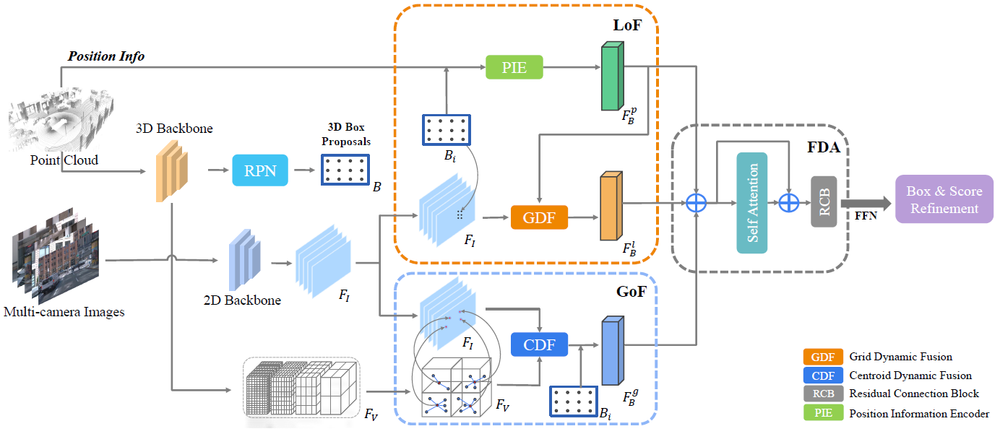

# LoGoNet
This repo is the official implementation of: [LoGoNet: Towards Accurate 3D Object Detection with Local-to-Global Cross-Modal Fusion](https://arxiv.org/abs/2303.03595). 
## Paper
- **[CVPR2023] [LoGoNet: Towards Accurate 3D Object Detection with Local-to-Global Cross-Modal Fusion](https://arxiv.org/abs/2303.03595).**

## Framework


## News
- :dart: [2023.04] Code released.
- :saxophone: [2023.03] LoGoNet is released on [arXiv](https://arxiv.org/abs/2303.03595).
- 🍻[2023.03] - Intend to test the robustness of your LiDAR semantic segmentation and detection models? Check our recent work, :robot: [Robo3D](https://github.com/ldkong1205/Robo3D), a comprehensive suite that enables OoD robustness evaluation of 3D segmentors and detectors on our newly established datasets: `SemanticKITTI-C`, `nuScenes-C`, and `WOD-C`.
- 🔥[2023.02.28] LoGoNet has been accepted by CVPR 2023!
- 🔥[2023.03] Our improved version, LoGoNet_Ens v2, ranks 1st leaderboard among all submissions. All the submission, please refer the [3D object detection leaderboard of Waymo Open Dataset](https://waymo.com/open/challenges/2020/3d-detection/) for more details.
- [2022.10] Our LoGoNet_Ens ranks 1st in the term of mAPH (L2) on the Waymo leaderboard among all methods with 81.02 mAPH (L2) and It is the first time for detection performance on three classes surpasses 80 APH (L2) simultaneously. 
- [2022.10] Our LoGoNet ranks 1st in the term of mAPH (L2) on the Waymo leaderboard among all methods that don't use TTA and Ensemble. 

## Algorithm Modules
  ```
  detection
  ├── al3d_det
  │   ├── datasets
  │   │   │── DatasetTemplate: the basic class for constructing dataset
  │   │   │── augmentor: different augmentation during training or inference
  │   │   │── processor: processing points into voxel space
  │   │   │── the specific dataset module
  │   ├── models: detection model related modules
  |   |   │── fusion: point cloud and image fusion modules
  │   │   │── image_modules: processing images
  │   │   │── modules: point cloud detector
  │   │   │── ops
  │   ├── utils: the exclusive utils used in detection module
  ├── tools
  │   ├── cfgs
  │   │   │── det_dataset_cfgs
  │   │   │── det_model_cfgs
  │   ├── train/test/visualize scripts  
  ├── data: the path of raw data of different dataset
  ├── output: the path of trained model
  al3d_utils: the shared utils used in every algorithm modules
  docs: the readme docs for LoGoNet
  ```


## Running
💥 This project relies heavily on `Ceph` storage. Please refer to your file storage system to modify the file path.
- Please cd the specific module and read the corresponding README for details
  - [Installation](docs/INSTALL.md)
  - [Data Preprocess](docs/DATA_PREPROCESS.md)
  - [Getting Started](docs/STARTED.md)


## Main results
### Performances on Waymo with AP/APH (L2)
*We report average metrics across all results. We provide training / validation configurations, pretrained models for all models in the paper. To access these pretrained models, please send us an email with your name, institute, a screenshot of the the Waymo dataset registration confirmation mail, and your intended usage. Please note that Waymo open dataset is under strict non-commercial license so we are not allowed to share the model with you if it will used for any profit-oriented activities. However, we can provide the logs. 
|  Model   | mAPH_L2 | VEH_L2 | PED_L2 | CYC_L2 | Log |
|  :-------:  |  :----: |  :----:  |  :----:  |  :----: |  :----:  |
| [LoGoNet-1frame  (val)](detection/tools/cfgs/det_model_cfgs/waymo/LoGoNet-1f.yaml) |  71.38 | 71.21/70.71 | 75.49/69.94 | 74.53/73.48| [log](https://drive.google.com/file/d/13oQETbn33902wy-fcq6qOj2dCM8UHmRT/view?usp=share_link)
| [LoGoNet-3frames (val)](detection/tools/cfgs/det_model_cfgs/waymo/LoGoNet-3f.yaml)  |  74.86 | 74.60/74.17 |78.62/75.79  | 75.44/74.61 | [log](https://drive.google.com/file/d/16-mYTeQsQ9Ku-6BWhhgLPXpUMQouDvjT/view?usp=share_link)
| [LoGoNet-5frames (val)](detection/tools/cfgs/det_model_cfgs/waymo/LoGoNet-5f.yaml)  |  75.54 | 75.84/75.38 | 78.97/76.33 |75.67/74.91  | [log](https://drive.google.com/file/d/1qjBnr0RvuA3QAahi3tUpl5envRLB45Uo/view?usp=share_link)
| LoGoNet-5frames (test)| 77.10 |79.69/79.30 | 81.55/78.91 |73.89/73.10 | [Record](https://waymo.com/open/challenges/entry/?challenge=DETECTION_3D&challengeId=DETECTION_3D)
| LoGoNet_Ens (test) |  81.02 |82.17/81.72| 84.27/81.28 |80.93/80.06| [Record](https://waymo.com/open/challenges/entry/?challenge=DETECTION_3D&challengeId=DETECTION_3D) 
| LoGoNet_Ens_v2 (test)| 81.96 | 82.75/82.32| 84.96/82.10 |82.36/81.46| [Record](https://waymo.com/open/challenges/entry/?challenge=DETECTION_3D&challengeId=DETECTION_3D) 


### Performances on KITTI with mAP
*We report average metrics across all results. We provide training / validation configurations, pretrained models for all models in the paper.
|  Model   | Car@40 | Ped@40 | Cyc@40| Log
|  :----:  |  :----:  |  :----:  |:----:  |:----:  |
| [LoGoNet (val)](detection/tools/cfgs/det_model_cfgs/kitti/LoGoNet-kitti.yaml) | 87.13 | 64.46 | 79.84| [log](https://drive.google.com/file/d/1QApkSbgFxwhKpIw7m7Mh3IZnla-_xmG9/view?usp=share_link) \| [weights](https://drive.google.com/file/d/1NMBi-s7bGMDMSslehdKU_GXpFEHE-5T5/view?usp=share_link)
| LoGoNet (test) | 85.87 | 48.57 | 73.61 |  [Record](https://www.cvlibs.net/datasets/kitti/eval_object_detail.php?&result=7e931a9e899c5716eba314a2013901c2685f05df) 

## Acknowledgement
We sincerely appreciate the following open-source projects for providing valuable and high-quality codes: 
- [OpenPCDet](https://github.com/open-mmlab/OpenPCDet)
- [mmdetection3d](https://github.com/open-mmlab/mmdetection3d)
- [Focalsconv](https://github.com/dvlab-research/FocalsConv)
- [CenterPoint](https://github.com/tianweiy/CenterPoint)
- [BEVFusion(ADLab-AutoDrive)](https://github.com/ADLab-AutoDrive/BEVFusion)
- [BEVFusion(mit-han-lab)](https://github.com/mit-han-lab/bevfusion)
- [mmdetection](https://github.com/open-mmlab/mmdetection)
- [PDV](https://github.com/TRAILab/PDV)
## Reference
If you find our paper useful, please kindly cite us via:
```
@inproceedings{logonet,
  title={LoGoNet: Towards Accurate 3D Object Detection with Local-to-Global Cross-Modal Fusion},
  author={Xin Li and Tao Ma and Yuenan Hou and Botian Shi and Yuchen Yang and Youquan Liu and Xingjiao Wu and Qin Chen and Yikang Li and Yu Qiao and Liang He},
  booktitle = {Proceedings of the IEEE Conference on Computer Vision and Pattern Recognition (CVPR)},
  year = {2023}
}
```
## Contact
- If you have any questions about this repo, please contact `lixin@pjlab.org.cn` and `shibotian@pjlab.org.cn`.
